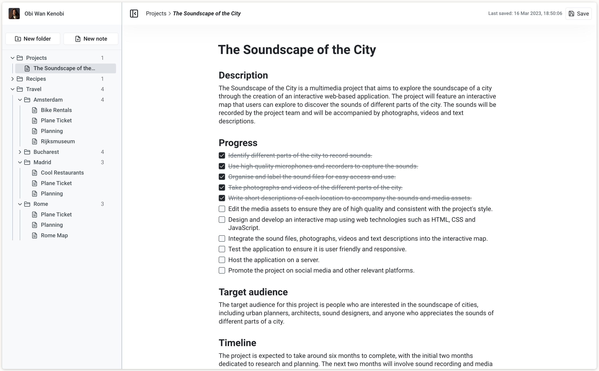

# TFG-VNotes

VNotes is a very small scale note taking app inspired by Notion. I have developed it for my university's Final Degree Project



## Project Setup

### Prerequisites

#### Node

[https://nodejs.org/en](https://nodejs.org/en)

It requires, at least Node 16 to be installed into your system. Since Node 16 is almost at the end of its lifetime, it has also been tested to work with Node 18.

#### Auth0

[https://auth0.com/](https://auth0.com/)

This project uses Auth0 for authentication. And it requires it to setup an Auth0 **API** and an  **Application** (SPA).

For the Application, make sure to:

* Add the following URLs to the **Allowed Callback URLs**: `http://localhost:3000, http://localhost:3000/workspace`
* Add the following URL to the **Allowed Logout URLs**: `http://localhost:3000`
* Add the following URL to the **Allowed Web Origins**: `http://localhost:3000, http://localhost:3000/workspace, http:localhost`
* Allow **Cross-Origin Authentication**.
* Add the following URL to the **Allowed Origins (CORS)**: `http://localhost:3000, http://localhost:3000/workspace, http:localhost`

The remaining settings should be fine if left in their default values.

In the case of the API, leaving the default settings should be enough.

Then, with the information from the Auth0 Application and API, you'll need an .env file at root level with the following contents:

`VITE_AUTH0_DOMAIN` ->  Domain of the tenant
`VITE_AUTH0_CLIENT_ID` -> Client ID of the Application
`VITE_AUTH0_CLIENT_SECRET` -> Client secret of the Application
`VITE_AUTH0_AUDIENCE` -> **Audience** of the API
`VITE_AUTH0_REDIRECT_URI` -> Redirect URI (must be one of the allowed callback URLs). Works better with `"http://localhost:3000/workspace"`
`VITE_AUTH0_SCOPE` -> "profile"

### Running the application

Make sure you have the [VNotes-Server](https://github.com/JustDMare/VNotes-Server) up and running before starting the frontend. Afterwards, just execute the following command to install the dependencies:

```sh
npm install
```

After the installation is complete, you only have to execute the following command to run the project:

```sh
npm run dev
```

### Run End-to-End Tests with [Cypress](https://www.cypress.io/)

Cypress can be launched with the following command:

```sh
npm run cypress
```

However, to run Cypress' tests you will need 2 more items in the .env file:
`CYPRESS_AUTH0_USERNAME`
`CYPRESS_AUTH0_PASSWORD`

These lead to a specific account used for the test suite. However, these will be provided by me, so without the specific credentials, the tests won't run properly. 

## Development

### Recommended IDE Setup

[VSCode](https://code.visualstudio.com/) + [Volar](https://marketplace.visualstudio.com/items?itemName=johnsoncodehk.volar) (and disable Vetur) + [TypeScript Vue Plugin (Volar)](https://marketplace.visualstudio.com/items?itemName=johnsoncodehk.vscode-typescript-vue-plugin).

### Type Support for `.vue` Imports in TS

TypeScript cannot handle type information for `.vue` imports by default, so we replace the `tsc` CLI with `vue-tsc` for type checking. In editors, we need [TypeScript Vue Plugin (Volar)](https://marketplace.visualstudio.com/items?itemName=johnsoncodehk.vscode-typescript-vue-plugin) to make the TypeScript language service aware of `.vue` types.

If the standalone TypeScript plugin doesn't feel fast enough to you, Volar has also implemented a [Take Over Mode](https://github.com/johnsoncodehk/volar/discussions/471#discussioncomment-1361669) that is more performant. You can enable it by the following steps:

1. Disable the built-in TypeScript Extension
    1) Run `Extensions: Show Built-in Extensions` from VSCode's command palette
    2) Find `TypeScript and JavaScript Language Features`, right click and select `Disable (Workspace)`
2. Reload the VSCode window by running `Developer: Reload Window` from the command palette.
